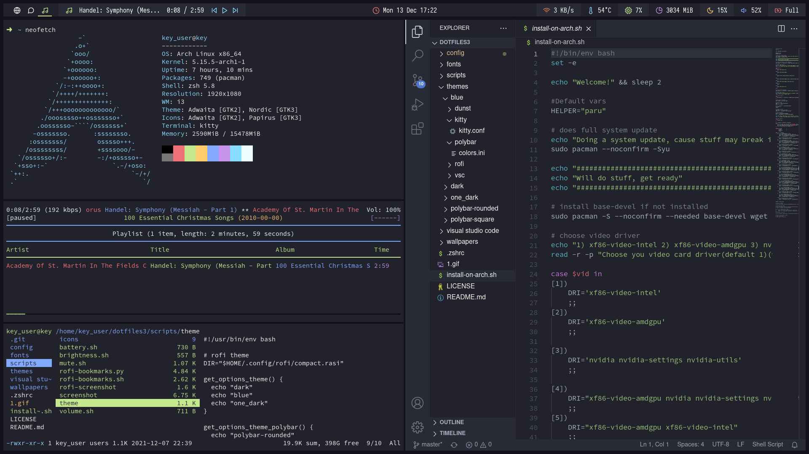

<div align="center">
  <!-- <a href="https://github.com/keyitdev/dotfiles">
    
  </a> -->
  <h1 align="center">Key dotfiles</h1>

  <p align="center">
    My first build of dotfiles. These dotfiles are based on modified One Dark color palette. Config include two themes (blue theme and dark).
    <br />
    <a href="https://github.com/deerrorer/dotfiles3#Showcase">Showcase</a>
    ·
    <a href="https://github.com/deerrorer/dotfiles3#Info">Info</a>
    ·
    <a href="https://github.com/deerrorer/dotfiles3#Dependecies">Dependecies</a>
    ·
    <a href="https://github.com/deerrorer/dotfiles3#Installation">Installation</a>
    ·
    <a href="https://github.com/deerrorer/dotfiles3#Keybinds">Keybinds</a>
    ·
    <a href="https://github.com/deerrorer/dotfiles3#Troubleshooting">Troubleshooting</a>
  </p>
</div>

<div align="center">


</div>

## Showcase



## Info

|Program|Name|
|-|-|
|**Window Manager**|[i3-gaps](https://github.com/Airblader/i3)|
|**Compositor**|[picom](https://github.com/yshui/picom)
|**Terminal emullator**|[kitty](https://github.com/kovidgoyal/kitty)|
|**Shell**|[zsh](https://www.zsh.org/)|
|**Shell theme**|[oh my zsh](https://github.com/ohmyzsh/ohmyzsh)|
|**Bar**|[polybar](https://github.com/polybar/polybar)|
|**Application launcher**|[rofi](https://github.com/davatorium/rofi)|
|**Notifications**|[dunst](https://github.com/dunst-project/dunst)|
|**Music**|[mpd](https://github.com/MusicPlayerDaemon/MPD), [ncmpcpp](https://github.com/ncmpcpp/ncmpcpp)
|**Text editor**|[Visual Studio Code](https://github.com/Microsoft/vscode), [neovim](https://github.com/neovim/neovim)|
|**Vsc theme**|[One Dark Pro](https://marketplace.visualstudio.com/items?itemName=zhuangtongfa.Material-theme)|
|**Neovim theme**|[NvChad](https://github.com/NvChad/NvChad)
|**GTK theme**|[Dracula (ant)](https://github.com/EliverLara/ant)|
|**GTK icons**|[Papirus](https://github.com/PapirusDevelopmentTeam/papirus-icon-theme)|
|**Discord Theme**|[My custom theme]()|

## Dependecies

### Packaged used
wget git i3-gaps i3blocks i3lock kitty zsh rofi dunst feh mpd ncmpcpp light xclip scrot picom imagemagick curl neovim ranger papirus-icon-theme pulseaudio pulseaudio-alsa pulsemixer alsa-utils xorg xorg-xinit xorg-server libnotify sddm btop acpi polybar ffcast slop

### Fonts used
* [Feather](https://github.com/AT-UI/feather-font/blob/master/src/fonts/feather.ttf)
* [Isovaka Nerd Font](https://www.nerdfonts.com/)
* [Open sans](https://fonts.google.com/specimen/Open+Sans#standard-styles)
* [Source Code Pro](https://fonts.google.com/specimen/Source+Code+Pro)

## Installation

### Arch
I recommend manually installing packages and coping files, but if you are lazy or are a productive person who don't want to waste your time, you can try  to use arch install script and commands bellow:

Clone dotfiles
```
git clone https://www.github.com/derrorer/dotfiles3.git
cd dotfiles3
chmod +x install-on-arch.sh
./install-on-arch.sh
```
Install oh my zsh
```sh
sh -c "$(curl -fsSL https://raw.githubusercontent.com/ohmyzsh/ohmyzsh/master/tools/install.sh)"
```
Set zsh as default shell
```sh
chsh -s /bin/zsh
sudo chsh -s /bin/zsh
```
Install NvChad
```sh
git clone https://github.com/NvChad/NvChad.git ~/.config/nvim --depth 10 && nvim +PackerSync
```
Install gtk3 theme
```sh
git clone https://github.com/EliverLara/Nordic.git
sudo mv ./Nordic /usr/share/themes
```
Install Grub2 theme
```sh
git clone https://github.com/vinceliuice/grub2-themes.git
sudo ./grub2-themes/install.sh -b -t tela -s 1080p
```
Install sddm astronaut
```sh
git clone https://github.com/totoro-ghost/sddm-astronaut.git ~/astronaut/
sudo mv ~/astronaut/ /usr/share/sddm/themes/
```
Install Firefox theme

[Blue theme](https://color.firefox.com/?theme=XQAAAAKGAQAAAAAAAABBqYhm849SCia73laEGccwS-xMDPr5iE6kjVUHIsGRvs0-q94VqJzDmLds0B4GdTFd2KORmhozpED9fKKY97YpmeSVCJcSVB9rwzacQGHhaYG0HJIDBXLbAYUnjpkVXo5LFBoIgdJ4P7MSUoS9tEpFY9l-n8P03V91Kq7BmmKKrjKq9Hi2Jvfl7wBEWz3nWVxnwd4XKskPQ2G_JFlEZFH-xMtfBJ5OSQmfzox2bvycbCOGiDW99yOqfX2u-cPiqZwcshaSPxDSqShJ5_7OhZzPbP5x-BM)

[Dark theme](https://color.firefox.com/?theme=XQAAAAKGAQAAAAAAAABBqYhm849SCia73laEGccwS-xMDPr23naIF864DqTISy5J31tQmo4zYnr3qoWRXy18FfYHv0j5dsS5Zn4VeZYHfEg0Mi5I09a8clJZYaw94hQkl9eHLzgyuQy8ueCQKoDVgn8FysNxflK_fFfPOiEydooCdnAI4SZrvjHrAWV7ap2g7rU6EQBz6eQkSheZ-OoKev4KWY32SFk0iVvqA1gBTGcvWGjotz54fr6yr3LnUk8Ls6XJUzalDr-NSsM0KYnKBBC6WZomzweHJrAhSH-jpflKZMY)

## Uninstallation

1. Remove installed packages (see [Dependecies](https://github.com/deerrorer/dotfiles3#Dependecies)),
2. Remove AUR helper ( ~/.srcs)
3. Change bask shell to bash 
```
chsh -s /bin/zsh root: sudo chsh -s /bin/zsh
```
4. Remove installed fonts (~/.local/share/fonts/),
5. Remove installed scripts (/usr/local/bin),
6. Delete this repo

## Keybinds

These are the basic keybinds. Read through the `i3` config for more keybinds.

|        Keybind         |                 Function                 |
| ---------------------- | ---------------------------------------- |
| `Win + Enter`          | Launch terminal (kitty)                  |
| `Win + Shift + Q`      | Close window                             |
| `Win + Q`              | Stacking layout                          |
| `Win + W`              | Tabbed layout                            |
| `Win + E`              | Default layout                           |
| `Win + A`              | Rofi sidebar menu                        |
| `Win + S`              | Rofi compact menu                        |
| `Win + D`              | Rofi center menu                         |
| `Win + Z`              | Rofi bookmarks                           |
| `Win + X`              | Change theme                             |
| `Win + C`              | Use screenshot script                    |
| `Win + G`              | Gaps settings                            |
| `Win + V`              | Set vertical orientation                 |
| `Win + H`              | Set horizontal orientation               |
| `Win + arrows (jkl;)`  | Resizing, moving windows                 |
| `Win + Shift + E`      | Exit i3                                  |
| `Win + Shift + R`      | Restart i3                               |

Note: `Win` refers to the `Super/Mod` key.

## Big thanks to

These dotfiles includes some files from others rices. Original sources:
* [Totoro](https://github.com/totoro-ghost) for [polybar frontend](https://github.com/totoro-ghost/dotfiles/tree/master/.config/polybar),
* [Adi1090x](https://github.com/adi1090x) for [rofi backend](https://github.com/adi1090x/rofi),
* [Alexander-Miller](https://github.com/Alexander-Miller) for [ncmpcpp config](https://github.com/Alexander-Miller/dotfiles/blob/master/.config/ncmpcpp/config),
* [Ceuk](https://github.com/ceuk/) for [rofi screenshot script](https://github.com/ceuk/rofi-screenshot).
* [Axarva](https://github.com/Axarva/) for [arch install script](https://github.com/Axarva/dotfiles-2.0/blob/main/install-on-arch.sh).

Not modified by me but used in these dotfiles
* [Nvchad team](https://github.com/NvChad/NvChad#chadributors) for [Nvchad](https://github.com/NvChad/NvChad),
* [EliverLara](https://github.com/EliverLara) for [gtk Dracula (ant) theme](https://github.com/EliverLara/alt),
* [Vinceliuice](https://github.com/vinceliuice) for [grub2 theme](https://github.com/vinceliuice/grub2-themes),
* [MarianArlt](https://github.com/MarianArlt) for [sddm theme](https://github.com/MarianArlt/sddm-sugar-dark),
[Totoro](https://github.com/totoro-ghost) for [sddm theme astronaut](https://github.com/totoro-ghost/sddm-astronaut).

## Troubleshooting

1. Polybar modules not working : Try changing variables (For example in battery module from BAT1 to BAT0).
2. Black flashing screen : Try changing picom config.
3. Scripts not working : Edit them.
4. Mpd not working : Check if any other app isn't using port 6600 (http://127.0.0.1:6600/)


## License

Distributed under the [GLPv3](https://www.gnu.org/licenses/gpl-3.0.html) License.

## To do
* patch
* readme

* discord wallpaper
* unistall oh my zsh script wallpaper credits

* [color]
* 
* background = #21222C
* background2 = #282A36
* background3 = #343746
* foreground = #F8F8F2
* sep = #F8F8F2
* 
* white = #FFFFFF
* black = #15121C
* red = #f07178
* green = #c3e88d
* yellow = #ffcb6b
* blue = #82aaff
* purple = #c792ea
* cyan = #89ddff
* pink = #ffa8c5
* orange = #dd864a
* 
* 
* [color]
* 
* background = #181a20
* background2 = #1d2025
* background3 = #202328
* foreground = #F8F8F2
* sep = #F8F8F2
* 
* white = #FFFFFF
* black = #15121C
* red = #f07178
* green = #c3e88d
* yellow = #ffcb6b
* blue = #82aaff
* purple = #c792ea
* cyan = #89ddff
* pink = #ffa8c5
* orange = #dd864a